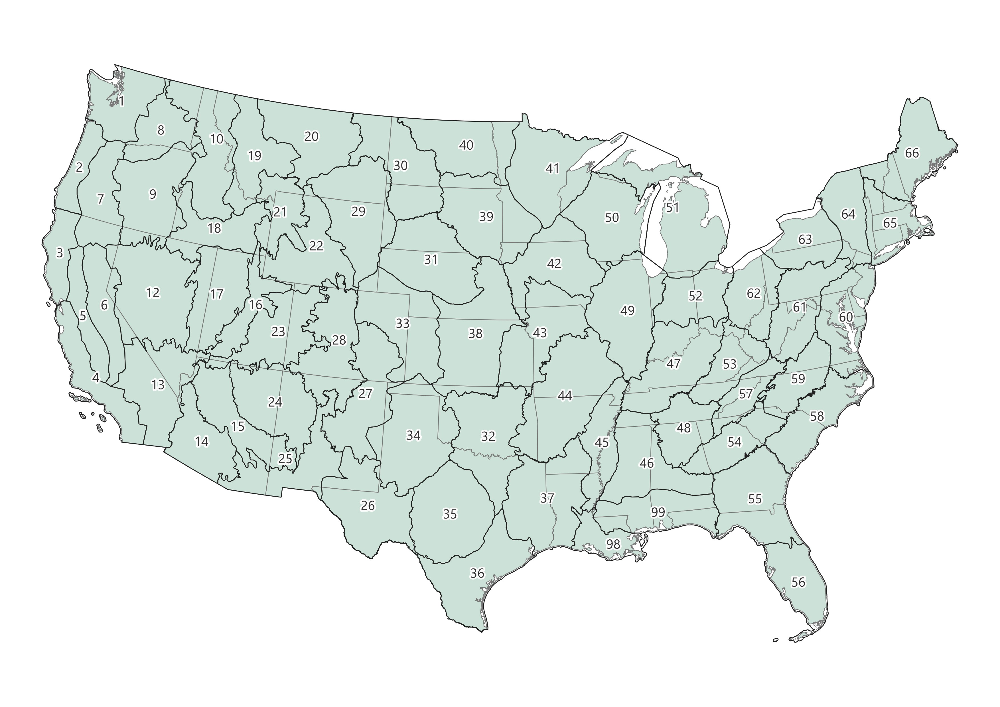

```{r setup, message=FALSE, warning=FALSE, include=FALSE}

library(janitor)
library(tidyverse)
library(stringr)
library(scales)
library(plotly)
library(viridis)
library(DT)
library(tidytext)
library(viridis)
library(gt)
library(knitr)
library(htmltools)
library(kableExtra)


section <- if (exists("params") && !is.null(params$section_na)) {
  params$section_na
} else {
  "Eastern Upper Peninsula"
}

# Read and wrangle raw data ----

## read in and minor wrangle data for vdep and bps x gap (which may not be used, but original code is set this way so keeping)

bps_remove_groups <- c(
  "Barren-Rock/Sand/Clay",
  "Fill-NoData",
  "Fill-Not Mapped",
  "Open Water",
  "Perennial Ice/Snow",
  "Sparse"
)

bps_scls_gap <- read.csv("inputs/bps_scl_gap_sections_2025.csv") |>
  clean_names() |>
  filter(section_na == section) |>
  filter(!groupveg %in% bps_remove_groups) |>
  mutate(raw_acres = round(count * 0.2223945)) |>
  mutate(across(everything(), ~replace(., . == -9999, 0)))

bps_transitions <- read.csv('inputs/bps_transitions.csv')

ref_con <- read.csv("inputs/ref_con_long.csv") |>
  rename(bps_model = model_code)

## read in data for evt-gap protected status-keeping only natural veg

evt_remove_phys <- c(
  "Open Water",
  "Sparsely Vegetated",
  "Developed-Roads",
  "Developed",
  "Developed-Medium Intensity",
  "Developed-Low Intensity",
  "Developed-High Intensity",
  "Quarries-Strip Mines-Gravel Pits-Well and Wind Pads",
  "Agricultural",
  "Snow-Ice",
  "Fill-NoData",
  "Exotic Herbaceous",
  "Exotic Tree-Shrub"
)

evt_gap_status <- read.csv("inputs/evt_gap_sections_2025.csv") |>
clean_names() |>
  filter(section_na == section) |>
  filter(!evt_phys %in% evt_remove_phys) |>
  mutate(acres = round(count * 0.2223945)) |>
  mutate(across(everything(), ~replace(., . == -9999, 0))) 

## by top 10.  commented out august 28 to go with greater than 10k acres below
# top_evt_names <- evt_gap_status |>
#   group_by(evt_name) |>
#   summarize(total_acres = sum(acres, na.rm = TRUE), .groups = "drop") |>
#   arrange(desc(total_acres)) |>
#   slice_head(n = 10) |>
#   pull(evt_name)

# evts with more than 1k acres
top_evt_names <- evt_gap_status |>
  group_by(evt_name) |>
  summarize(total_acres = sum(acres, na.rm = TRUE), .groups = "drop") |>
  filter(total_acres > 1000) |>
  arrange(desc(total_acres)) |>
  pull(evt_name)

evt_gap_status_top10 <- evt_gap_status |>
  filter(evt_name %in% top_evt_names)

# all evt names
all_evt_names <- evt_gap_status |>
  group_by(evt_name) |>
  summarize(total_acres = sum(acres, na.rm = TRUE), .groups = "drop") |>
  arrange(desc(total_acres)) 


# filtered for top evts > 10k acres
# top_evt_names_df <- evt_gap_status_top10 |>
#   group_by(evt_name)|>
#   summarize(acres = sum(acres)) |>
#   arrange(desc(acres))

# all EVTs filtered for top evts > 1k acres
top_evt_names_df <- evt_gap_status |>
  group_by(evt_name) |>
  summarize(acres = sum(acres, na.rm = TRUE)) |>
  filter(acres > 1000) |>
  arrange(desc(acres))


evt_totals <- evt_gap_status_top10 |>
  dplyr::filter(!is.na(gap_sts)) |>
  dplyr::group_by(evt_name, gap_sts) |>
  dplyr::summarize(
    acres = sum(acres, na.rm = TRUE),
    .groups = "drop"
  ) |>
  dplyr::group_by(evt_name) |>
  dplyr::summarize(
    total_acres = sum(acres),
    acres_1_3 = sum(acres[gap_sts %in% 1:3], na.rm = TRUE),
    .groups = "drop"
  )

evt_pad_summary <- evt_gap_status_top10 |>
  dplyr::filter(!is.na(gap_sts), gap_sts %in% 1:3) |>
  dplyr::group_by(evt_name, gap_sts) |>
  dplyr::summarize(
    acres = sum(acres, na.rm = TRUE),
    .groups = "drop"
  ) |>
  tidyr::complete(
    evt_name,
    gap_sts = 1:3,
    fill = list(acres = 0)
  ) |>
  dplyr::left_join(evt_totals, by = "evt_name") |>
  dplyr::mutate(
    pct = dplyr::if_else(total_acres > 0, acres / total_acres, 0),
    pct_sum = dplyr::if_else(total_acres > 0, acres_1_3 / total_acres, 0),
    evt_name = factor(evt_name, levels = top_evt_names_df$evt_name),
    gap_sts = factor(gap_sts, levels = 1:3)
  )


## read in data for bps to evt comparison chart

bps_evt <- read.csv("inputs/bps_evt_sections_2025.csv") |>
  clean_names() |>
  filter(section_na == section)


bps_evt_top50 <- head(bps_evt, n = 50)
 write.csv(bps_evt_top50, file = "bps_evt_top_50.csv")


# prep data for bps bar chart
bps_name_df <- bps_scls_gap |>
  group_by(bps_name) |>
  summarize(acres = sum(raw_acres, na.rm = TRUE)) |>
  filter(acres > 1000) |>
  arrange(desc(acres))

# |>
#   top_n(n = 10, wt = acres)

# prep data for disturbances chart

top_bps <- bps_name_df$bps_name

bps_trans_filt <- bps_transitions |>
  filter(bps_name %in% top_bps)

bps_trans_summarized <- bps_trans_filt |>
  mutate(pct_disturbed_yr = annual_probability * 100) |>
  group_by(bps_name, transition) |>
  summarize(
    pct_disturbed_yr = mean(pct_disturbed_yr, na.rm = TRUE),
    n_models = n(),        # optional but useful for QA
    .groups = "drop"
  )


bps_trans_plot <- bps_trans_summarized |>
  left_join(bps_name_df, by = "bps_name") |>
  mutate(
    bps_name = fct_reorder(bps_name, acres)
  )


## for map?
slugify <- function(x) {
  x <- tolower(x)
  x <- gsub("[^a-z0-9]+", "_", x)
  x <- gsub("^_+|_+$", "", x)
  x
}

locator_img <- file.path(
  "locator_maps",
  paste0(slugify(params$section_na), ".jpg")
)

stopifnot(file.exists(locator_img))


### evt bullets
number_evt <- length(unique(evt_gap_status$evt_name))

top_evt <- evt_gap_status_top10 |>
  slice_max(acres, n = 1) |>
  pull(evt_name)


total_count_evt <- sum(bps_evt$count, na.rm = TRUE)

evt_top10_pct <- bps_evt %>%
  group_by(evt_name) %>%
  summarise(count = sum(count, na.rm = TRUE), .groups = "drop") %>%
  arrange(desc(count)) %>%
  slice_head(n = 10) %>%
  summarise(pct = round(sum(count) / total_count_evt * 100)) %>%
  pull(pct)

# data for bps summary bullets

top_bps_name <- bps_name_df |>
  slice_max(acres, n = 1) |>
  pull(bps_name)

top_bps_acres <- bps_name_df |>
  slice_max(acres, n = 1) |>
  pull(acres)


number_of_bps <- length(unique(bps_scls_gap$bps_name))


total_count_bps <- sum(bps_evt$count, na.rm = TRUE)

bps_top10_pct <- bps_evt %>%
  group_by(bps_name) %>%
  summarise(count = sum(count, na.rm = TRUE), .groups = "drop") %>%
  arrange(desc(count)) %>%
  slice_head(n = 10) %>%
  summarise(pct = round(sum(count) / total_count_bps * 100)) %>%
  pull(pct)

bps_top10_pct


## ===== EVT protection summaries =====

# GAP 1–3 (overall protection)
low_protection_evts <- evt_pad_summary |>
  distinct(evt_name, pct_sum) |>
  arrange(pct_sum) |>
  slice_head(n = 3) |>
  mutate(
    label = paste0(
      evt_name,
      " (",
      scales::percent(pct_sum, accuracy = 1),
      ")"
    )
  )

low_evt_names <- paste(low_protection_evts$label, collapse = "; ")
min_pct <- min(low_protection_evts$pct_sum, na.rm = TRUE)

# GAP 1 (strict protection)
low_gap1_evts <- evt_pad_summary |>
  filter(gap_sts == "1") |>
  distinct(evt_name, pct) |>
  arrange(pct) |>
  slice_head(n = 3) |>
  mutate(
    label = paste0(
      evt_name,
      " (",
      scales::percent(pct, accuracy = 0.1),
      ")"
    )
  )

low_gap1_names <- paste(low_gap1_evts$label, collapse = "; ")

min_gap1_pct <- min(low_gap1_evts$pct, na.rm = TRUE)


## for sankey


evt_colors <- c(
  "Conifer"      = "#00542D",
  "Hardwood"     = "#B3D5A7",
  "Shrubland"    = "#5E3D7F",
  "Grassland"    = "#A4956E",
  "Riparian"     = "#5688C7",
  "Exotics"      = "#F15D50",
  "Agricultural" = "#FFE772",
  "Developed"    = "#999999"
)

groupveg_colors <- c(
  "Conifer"   = "#00542D",
  "Hardwood"  = "#B3D5A7",
  "Shrubland" = "#5E3D7F",
  "Grassland" = "#A4956E",
  "Riparian"  = "#5688C7"
)


bps_evt_norm <- bps_evt %>%
  mutate(
    evt_phys = case_when(
      evt_phys %in% c("Exotic Herbaceous", "Exotic Tree-Shrub") ~ "Exotics",
      evt_phys == "Agricultural"                               ~ "Agricultural",
      evt_phys == "Developed"                                  ~ "Developed",
      grepl("^Developed", evt_phys)                            ~ "Developed",
      grepl("Quarries|Strip Mines|Gravel", evt_phys)           ~ "Developed",
      evt_phys == "Sparsely Vegetated"                         ~ NA_character_,
      TRUE ~ evt_phys
    )
  ) %>%
  filter(!is.na(evt_phys))

top_bps_sankey <- bps_evt_norm %>%
  group_by(bps_name, groupveg) %>%
  summarise(bps_total = sum(count), .groups = "drop") %>%
  arrange(desc(bps_total)) %>%
  slice_head(n = 3) %>%
  mutate(
    bps_pct_total = bps_total / sum(bps_total),
    bps_label = paste0(str_wrap(bps_name, width = 55), " (", percent(bps_pct_total, accuracy = 1), ")"),
    bps_color = dplyr::coalesce(unname(groupveg_colors[groupveg]), "#c8c8c8")
  )
## TABLE


top_bps_summary <- bps_evt_norm %>%
  filter(bps_name %in% top_bps) %>%
  mutate(
    natural_veg = !evt_phys %in% c("Developed", "Agricultural")
  ) %>%
  group_by(bps_name) %>%
  summarise(
    total_area = sum(count, na.rm = TRUE),
    natural_area = sum(count[natural_veg], na.rm = TRUE),
    converted_area = total_area - natural_area,
    pct_natural_remaining = natural_area / total_area,
    .groups = "drop"
  ) %>%
  arrange(desc(total_area))


## Succession classes

bps_name_number <- read_csv("inputs/bps_model_number_name.csv") |>
  mutate(model_code = as.character(model_code))

sclass_descriptions <- read_csv("inputs/scls_descriptions.csv") |>
  mutate(bps_model = as.character(bps_model))

filtered_sclass <- sclass_descriptions |>
  left_join(
    bps_name_number,
    by = c("bps_model" = "model_code")
  )

# BpS models present in the ecological section being rendered
section_bps_models <- bps_scls_gap |>
  transmute(bps_model = as.character(bps_model)) |>
  distinct()

# Base URL only
url_template <- "https://github.com/rswaty/bps_docs_parse/raw/main/all_bps_docs/"

bps_urls <- filtered_sclass %>%
  distinct(bps_name, bps_model) %>%
  mutate(
    bps_model = as.character(bps_model),
    url = paste0(url_template, bps_model, ".docx"),
    link = paste0(
      "", url, "",
      bps_name, " (", bps_model, ")",
      "</a>"
    )
  )
  

# Prepare Current Succession Class Data ----

current_data <- bps_scls_gap |>
  select(count, bps_model, bps_name, label) |>
  unite(model_label, c("bps_model", "label"), remove = FALSE) |>
  group_by(bps_model, model_label, label, bps_name) |>
  summarise(
    count = sum(count),
    .groups = "drop") |>
  group_by(bps_model) |>
  mutate(
    bps_total = sum(count),
    current_percent = round(count / bps_total * 100)) |>
  ungroup()


# Select Most Prevalent BpS Model ----

top_bps_models <- current_data |>
  distinct(bps_model, bps_name, bps_total) |>
  arrange(desc(bps_total)) |>
  slice_head(n = 1)


```


## Introduction

::: {.columns}

::: {.column width="30%"}

Principle 6 of the [FSC US Forest Stewardship Standard (FSS)](https://us.fsc.org/forest-management/revised-fscr-us-forest-stewardship-standard-v2) aims to maximize positive environmental impacts and minimize adverse environmental impacts of management activities occurring within certified management units. Toward this desired outcome, Criterion 6.5 requires the identification and protection or restoration of native ecosystems that are not already adequately represented and protected in the landscape, defined here as the Ecological Section named above, and in the locator map to the right. 


:::

::: {.column width="70%"}
{fig-alt="Locator map for the ecological section"}
:::
:::

This tool serves to support certificate holders with the requirements of Criterion 6.5 related to Representative Sample Areas (RSAs), but importantly, does not ensure conformance. Additional information gathering and evaluation will most likely be required by certificate holders to ensure conformance with the elements of Criterion 6.5. It is not possible to establish a blanket measurement by which to determine “adequate” protection of all various and complex native ecosystems across the entirety of the conterminous US. 

This tool primarily helps with elements of Indicator 6.5.1 and may additionally assist in conformance with Indicators 6.5.2 - 6.5.6. It is deeply aligned with Annex G of the FSC US FSS, which provides guidance for identifying RSAs, as well as guidance for management and activities within RSAs and managing to restore more natural conditions inside or outside of RSAs.  

## Historic Native and Existing Ecosystems

The first step to identifying RSAs (as outlined in Annex G) is to identify native ecosystems that would typically occur in the management unit given current climate and soil conditions. This first section helps to identify the historic native ecosystems that should occur in the landscape given the existing climate and soil conditions (an essential element of Indicator 6.5.1). It then helps to identify the existing ecosystems that are currently present within the landscape (using [LANDFIRE](https://landfire.gov/) data).

Importantly, these assessments only cover the top 10 most prevalent ecosystems. For lesser present ecosystems, we suggest reviewing additional data sources such as State Wildlife Action Plans, [NatureServe](https://www.natureserve.org/), or local conservation initiatives to ensure you have a full understanding of the landscape(s) in which your management unit occurs.

This section also provides tables of the percent of the top 3 ecosystems that should occur given historic data (historic native ecosystems) that remain or are converted to currently present existing ecosystems.


::: {.callout-note}
We quantified Historic Native Ecosystems using LANDFIRE's [Biophysical Settings](https://landfire.gov/vegetation/bps) data and Existing Ecosystems using LANDFIRE’s [Existing Vegetation Type-Ecological Systems]([Existing Vegetation Type-Ecological Systems](https://landfire.gov/vegetation/evt)) data. See more about these datasets in “Key Concepts” section below.

Due to evolution of methods and naming conventions, the ecosystem names between the Historic Native and Existing ecosystem charts may be different.
 
:::

### Historic Native Ecosystems Greater than 1,000 acres

```{r}
#| label: bps chart
#| echo: false
#| message: false
#| warning: false
#| fig.height: 15
#| fig.width: 10

# plot
bps_name_chart <- 
  ggplot(bps_name_df, aes(x = bps_name, y = acres)) +
  geom_bar(stat = "identity", fill = "#00703C") +
  labs(
    subtitle = "",
    caption = "Biophysical Settings (refered to as Historic Native Ecosystems here) data obtained from https://landfire.gov/vegetation/bps.",
    x = "",
    y = "Acres") +
  scale_x_discrete(limits = rev(bps_name_df$bps_name),
                   labels = function(x) str_wrap(x, width = 40)) +
  scale_y_continuous(labels = comma) +
  coord_flip() +
  theme_bw(base_size = 12) +
  theme(
  panel.grid = element_blank(),
  plot.margin = margin(
    t = 5,
    r = 5,
    b = 5,
    l = 40
  )
)


bps_name_chart


```

<br>

```{r}
#| label: small bps list
#| echo: false
#| results: asis

small_bps <- bps_scls_gap |>
  group_by(bps_name) |>
  summarize(acres = sum(raw_acres, na.rm = TRUE), .groups = "drop") |>
  filter(acres < 1000) |>
  arrange(desc(acres)) |>
  pull(bps_name)

cat(
  paste0(
    "**According to LANDFIRE data, the Historic Native Ecosystems that occurred in less than 1,000 acres in this Ecological Section were:**\n\n",
    paste0("- ", small_bps, collapse = "\n")
  )
)
```

It is important to note that LANDFIRE data is designed for landscape-level assessments and not designed for analysis of ‘rare’ systems. Please take this into account, explore surrounding ecological sections, and look to more localized sources of information such as State Wildlife Action Plans, NatureServe, and others to better understand the likely historic and current occurrence of these rarer systems. 


### Existing Ecosystems Greater than 1,000 acres (as of 2024)


```{r}
#| label: evt chart
#| echo: false
#| message: false
#| warning: false
#| fig.height: 17
#| fig.width: 10


top_evt_names_df_plot <- top_evt_names_df |>
  filter(acres > 1000)

# plot
evt_name_chart <- 
  ggplot(top_evt_names_df_plot, aes(x = evt_name, y = acres)) +
  geom_bar(stat = "identity", fill = "#333333") +
  labs(
    subtitle = "",
    caption = "Data from https://landfire.gov/vegetation/evt. Developed and agricultural types removed.",
    x = "",
    y = "Acres") +
  scale_x_discrete(
  limits = rev(top_evt_names_df |> filter(acres > 1000) |> pull(evt_name)),
  labels = function(x) str_wrap(x, width = 40)) +
  scale_y_continuous(labels = comma) +
  coord_flip() +
  theme_bw(base_size = 12) +
  theme(
  panel.grid = element_blank(),
  plot.margin = margin(
    t = 5,
    r = 5,
    b = 5,
    l = 40
  )
)


evt_name_chart


```

<br>


```{r}
#| label: small evt list
#| echo: false
#| results: asis

small_evt <- all_evt_names |>
  filter(total_acres < 1000) |>
  arrange(desc(total_acres)) |>
  pull(evt_name)

if(length(small_evt) > 0) {

  cat(
    "**Existing Vegetation Types that had less than 1,000 acres in this Ecological Section were:**\n\n"
  )

  cat(
    paste0("- ", small_evt, collapse = "\n")
  )

  cat("\n\n")
}

```

<br>


::: {.callout-tip}
## Historic Native and Existing Ecosystems

For this Ecological Section:

* LANDFIRE data shows there were **`r number_of_bps`** Historic Native Ecosystems (by name, there may be more if counting by regional variants).  
* The top 10 Historic Native Ecosystems presented here covered **`r bps_top10_pct`%** of the total area. 
* As of 2024 LANDFIRE mapped **`r number_evt`** Existing Ecosystems for this Ecological Section.
* The top 10 Existing Ecosystems cover **`r evt_top10_pct`%** of the total area. 


:::

<br>

### Flow chart: Composition of Existing Ecosystems within the three most prevalent Historic Native Ecosystem footprints

For the charts below we assessed the amounts of each Existing Ecosystem (at a coarse level; includes agricultural and developed types) within each of the top 3 most prevalent Native Ecosystem footprints for this Ecological Section. 

<br>

**Understanding the Sankey charts:**

* The Historic Native Ecosystem is on the left, coarse-level Existing Ecosystems on the right.
* Hover over the grey horizontal bands to explore how Historic Native Ecosystems have split out to the associated Existing Ecosystems on the current landscape.  
* The total current percent of each Existing Ecosystem for this Ecological Section quantified in parentheses.


```{r}
#| label: bps to evt
#| echo: false
#| message: false
#| warning: false


make_sankey <- function(bps, bps_label, bps_color) {

  flows <- bps_evt_norm %>%
    filter(bps_name == bps) %>%
    group_by(evt_phys) %>%
    summarise(count = sum(count), .groups = "drop") %>%
    mutate(pct = count / sum(count)) %>%
    arrange(desc(pct))

  nodes <- c(bps_label, flows$evt_phys)

  node_index <- tibble(
    name = nodes,
    id = seq_along(nodes) - 1
  )

  links <- flows %>%
    left_join(node_index, by = c("evt_phys" = "name")) %>%
    mutate(
      source = 0,
      target = id,
      value  = pct,
      label = paste0("Currently ", percent(pct, accuracy = 1), " ", evt_phys
)

    )

  node_colors <- c(
    bps_color,
    ifelse(flows$evt_phys %in% names(evt_colors), evt_colors[flows$evt_phys], "#c8c8c8")
  )

plot_ly(
  type = "sankey",
  orientation = "h",
  node = list(
    label = nodes,
    color = node_colors,
    pad = 18,
    thickness = 20,
    font = list(size = 32),
    hoverinfo = "none"
  ),
  link = list(
    source = links$source,
    target = links$target,
    value  = links$value,
    customdata = paste0(
      "Currently ", percent(links$value, accuracy = 1), " ", flows$evt_phys
    ),
    hovertemplate = "%{customdata}<extra></extra>"
  )
)  |> layout(font = list(size = 18))
}

out <- lapply(seq_len(nrow(top_bps_sankey)), function(i) {
  tagList(
    tags$h3(top_bps_sankey$bps_label[i]),
    make_sankey(
      bps       = top_bps_sankey$bps_name[i],
      bps_label = top_bps_sankey$bps_label[i],
      bps_color = top_bps_sankey$bps_color[i]
    ),
    tags$br(), tags$br()
  )
})

tagList(out)


```


<br>

### Summary Table of Conversion

In the table below we summarize conversion of the top 10 Historic Native Ecosystems. All area values are in acres.  Click on column names to sort.

<br> 

```{r}
#| label: remining nat veg table
#| echo: false
#| message: false
#| warning: false


top_bps_summary %>%
  mutate(
    pct_num = pct_natural_remaining,   # numeric for sorting
    `Total Area` = comma(total_area),
    `Natural Vegetation Remaining` = comma(natural_area),
    `Converted (Agriculture + Developed)` = comma(converted_area),
    `Percent Natural Vegetation Remaining` = percent(pct_natural_remaining, accuracy = 0.1)
  ) %>%
  select(
    `Native Ecosystem` = bps_name,
    `Total Area`,
    `Natural Vegetation Remaining`,
    `Converted (Agriculture + Developed)`,
    `Percent Natural Vegetation Remaining`,
    pct_num
  ) %>%
  datatable(
    rownames = FALSE,
    options = list(
      dom = "t",                # <-- removes ALL table controls
      ordering = TRUE,
      columnDefs = list(
        list(visible = FALSE, targets = 5)  # hide the numeric sort col
      )
    )
  ) %>%


formatStyle(
  columns = 1:5,   # only visible columns
  `text-align` = "center"
)


```
 
 <br>
 
::: {.callout-note}
**Consideration:**  Before moving on to the next section, think through which ecosystems have been most impacted by conversion. If a system has largely been converted to agricultural and developed land uses AND it has low levels of protection below, it may be worth additional consideration.  
:::

<br>

## GAP Status

The second step to identifying RSAs (as outlined in Annex G) is to assess the adequacy of representation and protection of the identified native ecosystems within the landscape. This next section provides the first step to making this assessment by showing the percent of each of the existing ecosystems that covered more than 1,000ac and that [CE3.1](those listed above) that are protected in Gap Status 1, 2, or 3 lands. Importantly, this chart does not evaluate “adequate” vs “inadequate” levels of protection and representation, which will be unique to each identified ecosystem type and its distinct qualities. 


**The GAP status codes are defined as (copied from [https://www.usgs.gov/programs/gap-analysis-project/gap-status-code-frequently-asked-questions-faq](https://www.usgs.gov/programs/gap-analysis-project/gap-status-code-frequently-asked-questions-faq)): **


**Gap Status 1:** An area having permanent protection from conversion of natural land cover and a mandated management plan in operation to maintain a natural state within which disturbance events (of natural type, frequency, intensity, and legacy) are allowed to proceed without interference or are mimicked through management.

**Gap Status 2:** An area having permanent protection from conversion of natural land cover and a mandated management plan in operation to maintain a primarily natural state, but which may receive uses or management practices that degrade the quality of existing natural communities, including suppression of natural disturbance.

**Gap Status 3:** An area having permanent protection from conversion of natural land cover for the majority of the area, but subject to extractive uses of either a broad, low intensity type (for example, logging, Off-Highway Vehicle recreation) or localized intense type (for example, mining). It also confers protection to federally listed endangered and threatened species throughout the area.

**GAP status 4 not shown in chart below. Chart is interactive.  Hover over bars to get more information. **

```{r}
#| label: protected area
#| echo: false
#| message: false
#| warning: false


evt_pad_summary <- evt_pad_summary |>
  mutate(
    acres_gap = pct * total_acres,

    evt_label = paste0(
      evt_name,
      " (", scales::comma(total_acres), ")"
    ),

    evt_label = factor(
      evt_label,
      levels = unique(
        evt_label[match(top_evt_names_df$evt_name, evt_name)]
      )
    )
  )

evt_pad_summary <- evt_pad_summary |>
  mutate(
    evt_name = factor(
      evt_name,
      levels = top_evt_names_df$evt_name
    )
  )

n_evts <- dplyr::n_distinct(evt_pad_summary$evt_name)

plot_height <- max(
  1100,
  n_evts * 70
)

plot <-
  ggplot(
    evt_pad_summary,
    aes(
      x = evt_label,
      y = pct,
      fill = gap_sts,
      text = paste0(
        "Existing Ecosystem: ", evt_label,
        "<br>Gap Status: ", gap_sts,
        "<br>Percent: ", scales::percent(pct, accuracy = 1),
        "<br>Acres: ", scales::comma(round(acres_gap, 0))
      )
    )
  ) +
  geom_bar(
    stat = "identity",
    position = "stack",
    width = 0.6
  ) +
  coord_flip() +
  scale_x_discrete(
    limits = rev(levels(evt_pad_summary$evt_label)),
    labels = function(x) stringr::str_wrap(x, 25)
  ) +
  scale_y_continuous(
    labels = scales::percent_format(accuracy = 1)
  ) +
  scale_fill_manual(
    values = c(
      "#66A98A",
      "#5E3D7F",
      "#CCCCCC"
    ),
    drop = FALSE,
    na.translate = FALSE
  ) +
  theme_bw(base_size = 12) +
  theme(
    panel.grid = element_blank()
  ) +
  labs(
    fill = "Gap Status",
    subtitle = "Gap Status 1-3 for Existing Ecosystems",
    caption = "Data from landfire.gov and usgs.gov.",
    x = "",
    y = "Percent of Total Existing Ecosystem Protected by GAP Status 1, 2, & 3 within the Ecological Section"
  )

plotly::ggplotly(
  plot,
  height = plot_height,
  tooltip = "text"
) |>
  plotly::layout(
    autosize = TRUE,
    margin = list(
      l = 325,
      r = 40,
      t = 60,
      b = 80
    ),
    xaxis = list(
      fixedrange = TRUE,
      automargin = TRUE
    ),
    yaxis = list(
      fixedrange = TRUE,
      automargin = TRUE
    ),
    dragmode = FALSE,
    bargap = 0.4
  ) |>
  plotly::config(
    scrollZoom = FALSE,
    displayModeBar = FALSE,
    responsive = TRUE
  )


```


<br>

::: {.callout-tip}
**Protection Status**

* The lowest observed protection level is **`r scales::percent(min_pct, accuracy = 1)`**.
* Ecosystems with the least protection include: **`r low_evt_names`**.
* The lowest level of strict protection (GAP Status 1) is **`r scales::percent(min_gap1_pct, accuracy = 0.1)`**, with the least represented ecosystems including: **`r low_gap1_names`**.

:::


## Next Steps – No need to establish RSA(s)

If the result of the assessment conducted using the information above combined with additional research and justification on the part of the certificate holder shows that all native ecosystems are adequately represented or protected in the landscape, then there is no need to establish RSAs within the management unit. 

## Next Steps – Need to establish RSA(s)

Per Indicator 6.5.2, if the results of the assessment conducted using the information above combined with additional research and justification on the part of the certificate holder shows that there are native ecosystems that are not adequately represented or protected within the landscape, viable examples of these ecosystems will need to be designated as Representative Sample Areas within the management unit. If there are no viable examples, degraded examples that could be restored need to be designated as RSAs and managed to restore to more natural conditions.

When there is a need for RSAs, designating areas of native ecosystems within your management unit that represent underrepresented successional classes is encouraged, but not required. In these cases, the following sections may be helpful in advising decisions by providing a more in-depth view into levels of representation and protection of different successional classes for each ecosystem. 


## Reference vs Current Succession Classes and Historical Disturbances of the Dominant Historic Native Ecosystem

We quantified Historic Native Ecosystems using LANDFIRE's [Biophysical Settings](https://landfire.gov/vegetation/bps)  spatial data, "reference" succession class amounts from LANDFIRE's [Biophysical Settings Models](https://landfire.gov/vegetation/bps-models), and current amounts of each succession class using LANDFIRE's [Succession Class](https://landfire.gov/vegetation/sclass]) spatial data. See more about these datasets in the "Key Concepts" section below. 

Additionally, using the same datasets, we are able to estimate the percent of each Historic Native Ecosystem that is disturbed by specific disturbance types annually. 

::: {.callout-note}
Due to the complexities of multiple variants and scale, we only presentthe most common Historical Native Ecosystem per chart as an example of the analysis that can be conducted for all remaining ecosystems.  Please contact Randy Swaty at [rswaty@tnc.org](mailto:rswaty@tnc.org), and/or The Nature Conservancy's LANDFIRE team at [landfire@tnc.org](mailto:landfire@tnc.org) for more information. Also see [this GIS guide](https://thenatureconservancy.github.io/landfire-guide/) for instructions on how to do the succession class analysis using ArcGIS Pro and Microsoft Excel. 
:::

### Reference vs Current Succession Classes of the Dominant Historic Native Ecosystem 

**About the chart that follows:**

* The chart presents the most prevalent Historic Native Ecosystem model in this Ecological Section based on mapped area.
* A Historic Native Ecosystem may have multiple regional variants with different succession classes and reference conditions. The chart therefore uses the single most prevalent Historical Native Ecosystem variant rather than combining variants.
* The chart compares the LANDFIRE reference percentage with the current mapped percentage for each succession class.


**Reading succession class labels:**

* Early, Mid, and Late indicate developmental stages.
* OPN = Open canopy, CLS = Closed canopy, and ALL = All canopy conditions.  Each Biophysical Setting has custom Open/Closed canopy positions.  See Biophysical Settings description below to read about the species and specific canopy characteristics for each succession class. 
* UN indicates "Uncharacteristic Native" vegetation, where the vegetation is native but its current structure was not defined under reference conditions.
* UE indicates "Uncharacteristic Exotic" vegetation.
* The chart compares the reference amount of each succession class to the amount currently mapped within the dominant Historic Native Ecosystem.

<br> 

```{r}
#| label: sclass chart
#| echo: false
#| message: false
#| warning: false
#| fig.height: 9
#| fig.width: 11

# Prepare Current Succession Class Data ----

current_data <- bps_scls_gap |>
  select(count, bps_model, bps_name, label) |>
  unite(model_label, c("bps_model", "label"), remove = FALSE) |>
  group_by(bps_model, model_label, label, bps_name) |>
  summarise(
    count = sum(count),
    .groups = "drop") |>
  group_by(bps_model) |>
  mutate(
    bps_total = sum(count),
    current_percent = round(count / bps_total * 100)) |>
  ungroup()


# Select Most Prevalent BpS Model ----

message("section: ", section)
message("top bps model: ", top_bps_models$bps_model[[1]])
message("top bps name: ", top_bps_models$bps_name[[1]])
message(
  "disturbance rows: ",
  sum(bps_transitions$bps_name == top_bps_models$bps_name[[1]]))
message(
  "document rows: ",
  sum(bps_urls$bps_model == top_bps_models$bps_model[[1]]))

top_bps_models <- current_data |>
  distinct(bps_model, bps_name, bps_total) |>
  arrange(desc(bps_total)) |>
  slice_head(n = 1)


top_bps_doc <- bps_urls |>
  filter(bps_model == top_bps_models$bps_model[[1]]) |>
  pull(link) |>
  first()


# Prepare Reference Succession Class Data ----

aoi_ref_con <- ref_con |>
  filter(bps_model %in% top_bps_models$bps_model) |>
  select(
    bps_model,
    model_label,
    ref_percent,
    ref_label) |>
  filter(!endsWith(model_label, "_Water")) |>
  rename(label = ref_label)


# Prepare Succession Class Labels ----

sclass_labels <- sclass_descriptions |>
  filter(bps_model %in% top_bps_models$bps_model) |>
  select(
    bps_model,
    label,
    class_id) |>
  distinct()


# Combine Reference and Current Data ----

scls_data <- aoi_ref_con |>
  left_join(
    current_data |>
      select(
        bps_model,
        bps_name,
        bps_total,
        model_label,
        label,
        count,
        current_percent),
    by = c(
      "bps_model",
      "model_label",
      "label")) |>
  left_join(
    sclass_labels,
    by = c(
      "bps_model",
      "label")) |>
  mutate(
    bps_name = coalesce(
      bps_name,
      top_bps_models$bps_name[[1]]),
    bps_total = coalesce(
      bps_total,
      top_bps_models$bps_total[[1]]),
    count = replace_na(count, 0),
    ref_percent = replace_na(ref_percent, 0),
    current_percent = replace_na(current_percent, 0),
    class_id = coalesce(class_id, label),
    class_label = case_when(
      label == "UN" ~ "UN",
      label == "UE" ~ "UE",
      TRUE ~ class_id)) |>
  pivot_longer(
    cols = c(ref_percent, current_percent),
    names_to = "ref_cur",
    values_to = "percent") |>
  mutate(
    ref_cur = factor(
      ref_cur,
      levels = c(
        "current_percent",
        "ref_percent"),
      labels = c(
        "Present",
        "Reference")))


# Order Succession Classes ----

class_levels <- scls_data |>
  distinct(label, class_id) |>
  mutate(
    class_label = case_when(
      label == "UN" ~ "UN",
      label == "UE" ~ "UE",
      label == "Agriculture" ~ "Agriculture",
      label == "Developed" ~ "Developed",
      TRUE ~ class_id),
    class_order = match(
      label,
      c(
        "A",
        "B",
        "C",
        "D",
        "E",
        "UN",
        "UE",
        "Agriculture",
        "Developed"))) |>
  arrange(class_order) |>
  pull(class_label)

scls_data <- scls_data |>
  mutate(
    class_label = case_when(
      label == "UN" ~ "UN",
      label == "UE" ~ "UE",
      label == "Agriculture" ~ "Agriculture",
      label == "Developed" ~ "Developed",
      TRUE ~ class_id))


# Create Chart Labels ----

top_bps_chart_name <- top_bps_models$bps_name[[1]]

top_bps_chart_model <- top_bps_models$bps_model[[1]]

sclass_chart_subtitle <- paste0(
  top_bps_chart_name,
  " | LANDFIRE BpS Model ",
  top_bps_chart_model)


# Plot Succession Classes ----

sclasplot <-
  ggplot(
    scls_data,
    aes(
      x = class_label,
      y = percent,
      fill = ref_cur)) +
  geom_col(
    width = 0.72,
    position = position_dodge(width = 0.78)) +
  coord_flip() +
  scale_x_discrete(
    limits = rev(class_levels),
    labels = function(x) stringr::str_wrap(x, width = 35)) +
  scale_y_continuous(
    labels = scales::label_percent(scale = 1),
    expand = expansion(mult = c(0, 0.05))) +
  scale_fill_manual(
    values = c(
      "Present" = "#4E84AF",
      "Reference" = "#66A98A"),
    name = NULL) +
  labs(
    title = sclass_chart_subtitle,
    caption = "Data from landfire.gov.",
    x = NULL,
    y = "Percent of BpS model area") +
  theme_bw(base_size = 13) +
  theme(
    legend.position = "top",
    legend.justification = "left",
    plot.title.position = "plot",
    plot.caption.position = "plot",
    plot.caption = element_text(
      hjust = 0,
      face = "italic"))

sclasplot
```
 
 <br>
 
**Reference document for the dominant Historic Native Ecosystem:**

`r top_bps_doc`


### Annual Historical Disturbance Amounts for top Historic Native Ecosystem


```{r}
#| label: disturbances
#| echo: false
#| message: false
#| warning: false
#| fig.height: 6
#| fig.width: 11

# Historical Disturbance Regime ----

top_bps_model_dist <- top_bps_models$bps_model[[1]]
top_bps_name_dist <- top_bps_models$bps_name[[1]]

trans_levels <- bps_transitions |>
  filter(model_code == top_bps_model_dist) |>
  distinct(transition) |>
  arrange(transition) |>
  pull(transition)

bps_trans_plot <- bps_transitions |>
  filter(model_code == top_bps_model_dist) |>
  mutate(
    pct_disturbed_yr = annual_probability * 100,
    transition = factor(
      transition,
      levels = rev(trans_levels)))

ggplot(
  bps_trans_plot,
  aes(
    x = pct_disturbed_yr,
    y = transition)) +
  geom_col(width = 0.55) +
  scale_x_continuous(
    labels = label_percent(scale = 1),
    expand = expansion(mult = c(0, 0))) +
  labs(
    title = top_bps_name_dist,
    subtitle = paste0(
      "LANDFIRE BpS Model ",
      top_bps_model_dist),
    x = "Percent disturbed per year",
    y = NULL) +
  theme_bw(base_size = 13) +
  theme(
    panel.grid.minor = element_blank(),
    plot.margin = margin(
      t = 5,
      r = 0,
      b = 5,
      l = 0))

```


## Key Concepts about the input data from LANDFIRE:

In order to better understand the the quantity of historical ecosystems, their protection status, ecological condition and natural disturbance regimes at a landscape scale, we summarized LANDFIRE and GAP data to Ecological Sections. These summaries are coarse, aimed at setting context and setting the stage for structured analysis of more local management areas. 

**Key Concepts about the input data:**

In order to better understand the quantity of historic ecosystems, their protection status, ecological condition and natural disturbance regimes at a landscape scale, we summarized LANDFIRE and GAP data to Ecological Sections. These summaries are coarse, aimed at setting context and setting the stage for structured analysis of more local management areas.

* The Biophysical Settings (BpS) data represents the “habitat” of an ecosystem, based on abiotic factors such as soils, surficial geology, slope, elevation and aspect, plus the current climate. Each BpS has a reference document that describes how it looked and functioned prior to European colonization and a state-and-transition model that estimates how much of each “Succession Class” (see below) would have occurred within the habitat based on best approximations of the natural disturbance regime (referred to below as ‘reference’). The BpSs are based on NatureServe’s Ecological Systems. This data represents ecosystems that “should” occur in the landscape. We call these Historic Native Ecosystems. 
* Succession Classes (s-class) are essentially developmental and/or structural stages. There are up to 5 defined for each BpS and are based on lifeform (e.g., broadleaf or needleleaf), and ranges of canopy cover (e.g., 70-80%) and canopy height (e.g., 10-25M ). In addition to modeled estimates of reference percents of each SCL, succession classes are mapped across the US today so that we can compare reference to current amounts.
* Existing Vegetation Type (EVT) data represents the current distribution of NatureServe’s Ecological Systems. Because of subsequent review and improvement, BpS and EVT names and lists for particular places may not always match. This data represents ecosystems that occur in the landscape. [CE9.1]. We call these Existing Ecosystems.
* GAP Status data identifies the level of biodiversity protection provided to ecosystems based on management intent and legal mandates. This information helps assess the extent to which Existing Ecosystems are represented within lands managed for long-term conservation of biodiversity. 


## Historic Native Ecosystem Descriptions 

To better understand 'reference' conditions for the Historic Native Ecosystems of the US, the LANDFIRE program developed descriptions plus accompanying state-and-transition models that depict how these systems 'looked and functioned' with natural disturbance regimes.  Below you can download the descriptions for the dominant Native Ecosystems and explore the succession class descriptions in a table.

LANDFIRE developed and delivers this information by Map Zone.  If an ecosystem crosses multiple Map Zones there may be multiple 'variants'.  In the table of links to the descriptions you will see "Model Codes", which represent an unique 5 digit code for the system followed by a list of Map Zones that description applies to.  





```{r}
#| label: bps_urls
#| echo: false
#| message: false
#| warning: false


datatable(
  bps_urls %>%
    select(
      `Native Ecosystem` = bps_name,
      `Model Code` = bps_model,
      `Document` = link),
  escape = FALSE,
  rownames = FALSE,
  options = list(
    dom = "fltip",
    pageLength = 10))


```


